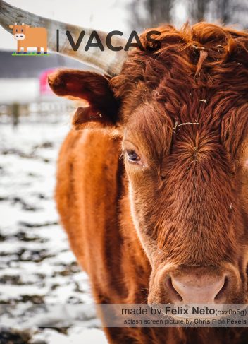

# VACAS - Vehicle Accounts Automation Service

> This program is used to create a confluence page with a list of vehicle accounts. These vehicle accounts are taken from CDC-int and CDC-emea and then formatted to an html.
> 
> The concluence page created on this process can be seen on the link: https://atc.bmwgroup.net/confluence/display/ELECSYSBR/EG-8-BR+Vehicle+Accounts%27+List

### Next steps

This project is still under development:

- [x] Create GUI
- [x] Make dist files
- [ ] Support Windows
- [ ] Create CLI

## 🚀 Installing <VACAS>

To install <VACAS>, follow these steps:

MacOS:
1. Download repository;
2. App is in DIST folder.

Windows:
Still under development. I need testers! :)

## ☕ Using <Vacas>

To use <Vacas>, follow these steps:
1. Go to `DIST` folder;
2. Run `VACAS.app`;
3. Confirm any pop-up that may appear;
4. App will open;
5. Enter you QX, password and confluence password (confluence password and QX password may be the same);
6. Click Start;
7. App may take a few minutes to run all the vehicles in the list.

If you want to change the vehicles list:
1. Go to `vacas/resources/vehicles`;
2. Open `vehicleslist.csv`;
3. Put each VIN one bellow the other.

To change the confluence page it will upload:
1. Go to `vacas`;
2. Open `config.yaml`;
3. Change the ID at `confluence_page`.

## 📫 Contributing <VACAS>
To contribute to <VACAS>, follow these steps:

1. Fork this repository;
2. Create a branch: `git checkout -b <branch_name>`.
3. Make changes and commit: `git commit -m '<commit_message>'`
4. Push to the original branch `git push origin <vacas> / <local>`
5. Create a pull request.

## 🤝 Contributors

Please, make this list bigger:

<table>
  <tr>
    <td align="center">
      <a href="#">
         
        
          <b>Felix Neto</b>
        
      </a>
    </td>
  </tr>
</table>

## 😄 Seja um dos contribuidores 

Wanna contribute? Send me an email: felix.neto@partner.bmw.com.br

## 📝 License

We all know, there will be licenses: [LICENÇA](LICENSE)

[⬆ Voltar ao topo](#VACAS) 